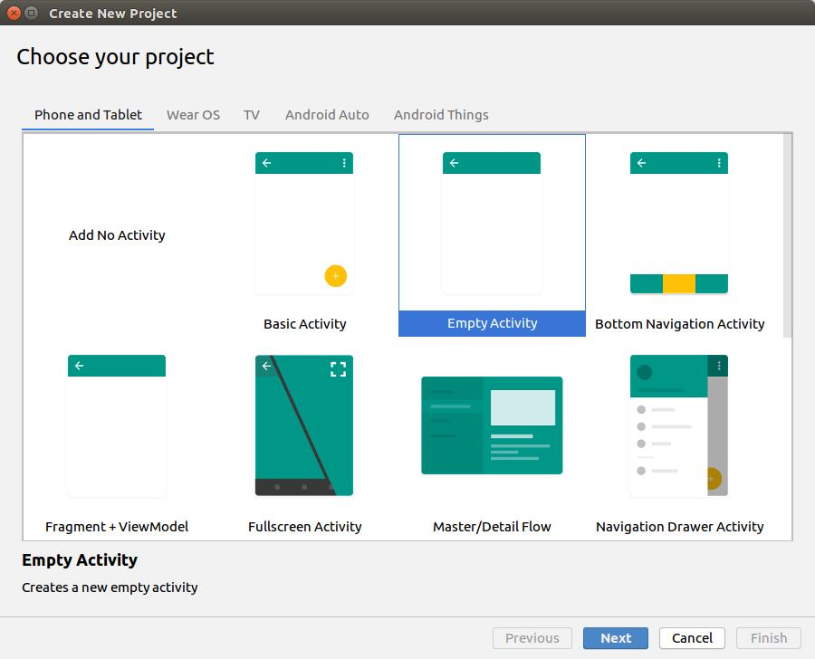
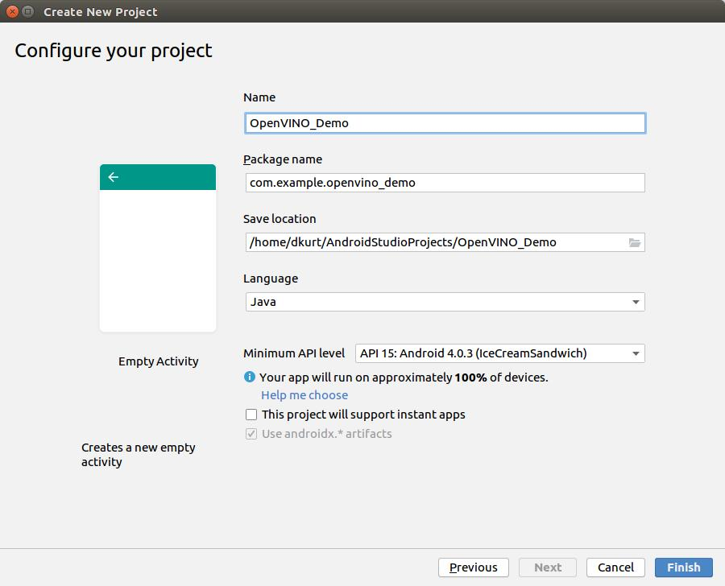
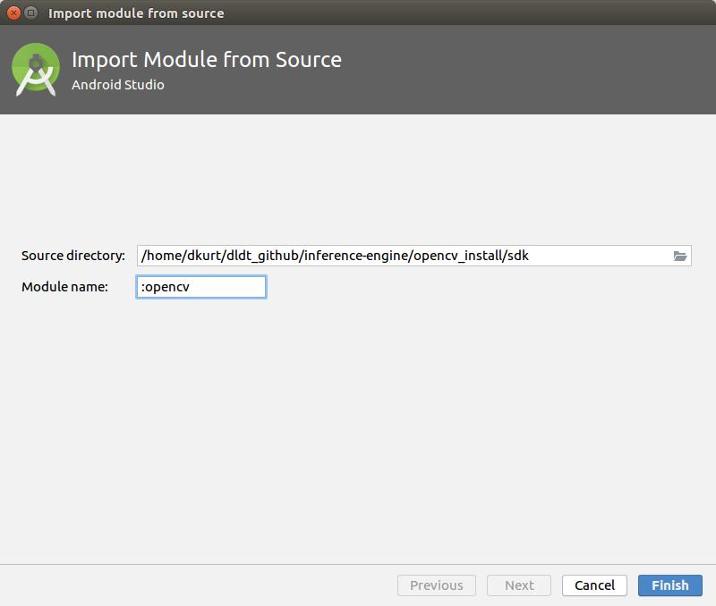
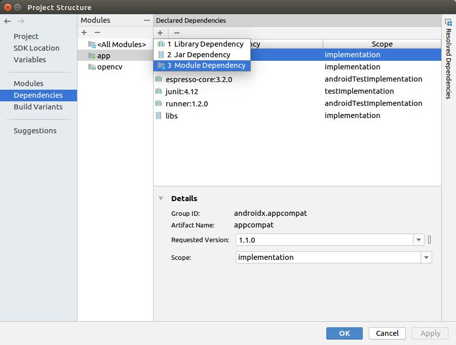
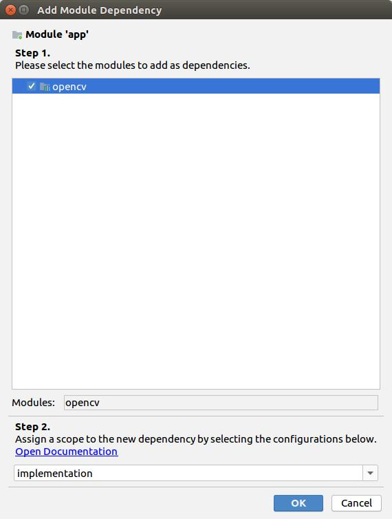

This guide will show you how to create an app in Android Studio with OpenVINO.
Tested with Android Studio 3.5.

## Create a project

1. Build the DLDT and OpenCV libraries using `build_all.sh`:

  ```bash
  cd dldt/inference-engine
  sh build_all.sh
  ```

2. Open Android Studio and create a new project: `File -> New -> New Project`

  

  

3. Add OpenCV module: `File -> New -> Import module`. Choose a path to `dldt/inference-engine/opencv_install/sdk`

  

4. Go to `File -> Project Structure`. Add OpenCV module depedency.

  

  

5. Try to build a project. If you faced a errror with message such "Suggestion: use a compatible library with a minSdk of at most 15", open `"Gradle Scripts" -> "build.gradle (Module:opencv)"` and replace `minSdkVersion 21` to `minSdkVersion 15`.


## Hello world: display frames from a camera

Let's create a "Hello world!" application which displays frames from camera:

1. Modify `app/manifests/AndroidManifest.xml`:

  ```xml
  <?xml version="1.0" encoding="utf-8"?>
  <manifest xmlns:android="http://schemas.android.com/apk/res/android"
      package="com.example.openvino_demo">

      <application
          android:allowBackup="true"
          android:icon="@mipmap/ic_launcher"
          android:label="@string/app_name"
          android:roundIcon="@mipmap/ic_launcher_round"
          android:supportsRtl="true"
          android:theme="@style/Theme.AppCompat.NoActionBar">  <!--Full screen mode-->

          <activity android:name=".MainActivity"
              android:screenOrientation="landscape">  <!--Screen orientation-->
              <intent-filter>
                  <action android:name="android.intent.action.MAIN"/>

                  <category android:name="android.intent.category.LAUNCHER"/>
              </intent-filter>
          </activity>

      </application>

      <!--Allow to use a camera-->
      <uses-permission android:name="android.permission.CAMERA"/>
      <uses-feature android:name="android.hardware.camera" android:required="false"/>
      <uses-feature android:name="android.hardware.camera.autofocus" android:required="false"/>
      <uses-feature android:name="android.hardware.camera.front" android:required="false"/>
      <uses-feature android:name="android.hardware.camera.front.autofocus" android:required="false"/>
  </manifest>
  ```

  > **NOTE**: replace `com.example.openvino_demo` with name of your package.

2. Modify `res/layout/activity_main.xml`:
  ```xml
  <?xml version="1.0" encoding="utf-8"?>
  <androidx.constraintlayout.widget.ConstraintLayout
      xmlns:android="http://schemas.android.com/apk/res/android"
      xmlns:tools="http://schemas.android.com/tools"
      android:layout_width="match_parent"
      android:layout_height="match_parent"
      tools:context="com.example.openvino_demo.MainActivity">

  <org.opencv.android.JavaCameraView
      android:id="@+id/CameraView"
      android:layout_width="match_parent"
      android:layout_height="match_parent"
      android:visibility="visible" />

  </androidx.constraintlayout.widget.ConstraintLayout>
  ```

  > **NOTE**: replace `com.example.openvino_demo` with name of your package.


3. Modify `app/java/com.example.openvino_demo/MainActivity.java`:

  ```java
  package com.example.openvino_demo;

  import android.os.Bundle;
  import org.opencv.android.CameraActivity;

  import org.opencv.android.CameraBridgeViewBase;
  import org.opencv.android.CameraBridgeViewBase.CvCameraViewFrame;
  import org.opencv.android.CameraBridgeViewBase.CvCameraViewListener2;
  import org.opencv.core.Mat;

  public class MainActivity extends CameraActivity implements CvCameraViewListener2 {

      @Override
      public void onResume() {
          super.onResume();
          System.loadLibrary("opencv_java4");
          mOpenCvCameraView.enableView();
      }

      @Override
      protected void onCreate(Bundle savedInstanceState) {
          super.onCreate(savedInstanceState);
          setContentView(R.layout.activity_main);
          // Set up camera listener.
          mOpenCvCameraView = (CameraBridgeViewBase) findViewById(R.id.CameraView);
          mOpenCvCameraView.setVisibility(CameraBridgeViewBase.VISIBLE);
          mOpenCvCameraView.setCvCameraViewListener(this);
          mOpenCvCameraView.setCameraPermissionGranted();
          mOpenCvCameraView.setMaxFrameSize(640, 480);
      }

      @Override
      public void onCameraViewStarted(int width, int height) {}

      @Override
      public void onCameraViewStopped() {}

      public Mat onCameraFrame(CvCameraViewFrame inputFrame) {
          Mat frame = inputFrame.rgba();
          return frame;
      }

      private CameraBridgeViewBase mOpenCvCameraView;
  }
  ```

4. Copy the following libraries to `AndroidStudioProjects/OpenVINO_Demo/opencv/native/libs/x86_64`:

```bash
dldt/inference-engine/bin/intel64/Release/lib/libinference_engine.so
dldt/inference-engine/bin/intel64/Release/lib/libtbb.so
dldt/inference-engine/bin/intel64/Release/lib/libc++_shared.so
```

## Deep learning sample (CPU)
In this section we will run deep learning network using OpenCV Java API and Intel's
Inference Engine backend on CPU.

1. Download face detection network:

  ```bash
  wget https://download.01.org/opencv/2019/open_model_zoo/R2/20190716_170000_models_bin/face-detection-adas-0001/FP32/face-detection-adas-0001.bin
  wget https://download.01.org/opencv/2019/open_model_zoo/R2/20190716_170000_models_bin/face-detection-adas-0001/FP32/face-detection-adas-0001.xml
  ```

2. Copy network to the device:

  ```bash
  adb push face-detection-adas-0001.bin /data/data/com.example.openvino_demo/
  adb push face-detection-adas-0001.xml /data/data/com.example.openvino_demo/
  ```

3. Modify `app/java/com.example.openvino_demo/MainActivity.java`:

  ```java
  package com.example.openvino_demo;

  import android.os.Bundle;

  import org.opencv.android.CameraActivity;

  import org.opencv.android.CameraBridgeViewBase;
  import org.opencv.android.CameraBridgeViewBase.CvCameraViewFrame;
  import org.opencv.android.CameraBridgeViewBase.CvCameraViewListener2;
  import org.opencv.core.Mat;
  import org.opencv.core.Point;
  import org.opencv.core.Scalar;
  import org.opencv.core.Size;
  import org.opencv.dnn.Dnn;
  import org.opencv.dnn.Net;
  import org.opencv.imgproc.Imgproc;

  public class MainActivity extends CameraActivity implements CvCameraViewListener2 {

      @Override
      public void onResume() {
          super.onResume();
          System.loadLibrary("inference_engine");  // This is a workaround for std::bad_cast exception. Works in the same way as LD_PRELOAD
          System.loadLibrary("opencv_java4");
          mOpenCvCameraView.enableView();
      }

      @Override
      protected void onCreate(Bundle savedInstanceState) {
          super.onCreate(savedInstanceState);
          setContentView(R.layout.activity_main);
          // Set up camera listener.
          mOpenCvCameraView = (CameraBridgeViewBase) findViewById(R.id.CameraView);
          mOpenCvCameraView.setVisibility(CameraBridgeViewBase.VISIBLE);
          mOpenCvCameraView.setCvCameraViewListener(this);
          mOpenCvCameraView.setCameraPermissionGranted();
          mOpenCvCameraView.setMaxFrameSize(640, 480);
      }

      @Override
      public void onCameraViewStarted(int width, int height) {
          net = Dnn.readNet("/data/data/com.example.openvino_demo/face-detection-retail-0005.xml",
                            "/data/data/com.example.openvino_demo/face-detection-retail-0005.bin");
      }

      @Override
      public void onCameraViewStopped() {}

      public Mat onCameraFrame(CvCameraViewFrame inputFrame) {
          Mat frame = inputFrame.rgba();

          Mat frameBGR = new Mat();
          Imgproc.cvtColor(frame, frameBGR, Imgproc.COLOR_RGBA2BGR);

          Mat blob = Dnn.blobFromImage(frameBGR, 1.0, new Size(672, 384));

          net.setInput(blob);
          Mat detections = net.forward();

          int cols = frame.cols();
          int rows = frame.rows();
          detections = detections.reshape(1, (int)detections.total() / 7);
          for (int i = 0; i < detections.rows(); ++i) {
              double confidence = detections.get(i, 2)[0];
              if (confidence < 0.5)
                  continue;

              int left   = (int)(detections.get(i, 3)[0] * cols);
              int top    = (int)(detections.get(i, 4)[0] * rows);
              int right  = (int)(detections.get(i, 5)[0] * cols);
              int bottom = (int)(detections.get(i, 6)[0] * rows);
              // Draw rectangle around detected object.
              Imgproc.rectangle(frame, new Point(left, top), new Point(right, bottom),
                                new Scalar(0, 255, 0));
          }
          return frame;
      }

      private CameraBridgeViewBase mOpenCvCameraView;
      private Net net;
  }
  ```

4. Copy CPU plugin to `AndroidStudioProjects/OpenVINO_Demo/opencv/native/libs/x86_64`:

  ```bash
  dldt/inference-engine/bin/intel64/Release/lib/libMKLDNNPlugin.so
  dldt/inference-engine/bin/intel64/Release/lib/libcpu_extension.so
  ```

## Deep learning sample (GPU)

This section describes how to enable GPU plugin for deep learning.

1. OpenCL runtime
  * Download OpenCL runtime for Android: https://github.com/dkurt/compute-runtime-android/.
  Copy an archive to the device and unpack.
  * Create a folder `/system/vendor/Khronos/OpenCL/vendors`. Copy `intel.icd` to it.

2. Copy the following libraries to `AndroidStudioProjects/OpenVINO_Demo/opencv/native/libs/x86_64`:

  ```bash
  libigc.so
  libigdgmm.so
  libopencl-clang.so
  libOpenCL.so
  libigdfcl.so
  libigdrcl.so
  ```

3. Copy the following libraries to `AndroidStudioProjects/OpenVINO_Demo/opencv/native/libs/x86_64`:

  ```bash
  dldt/inference-engine/bin/intel64/Release/lib/libclDNN64.so
  dldt/inference-engine/bin/intel64/Release/lib/libclDNNPlugin.so
  ```

4. Enable OpenCL cache to reduce networks compilation time.
  * Create a cache folder: `/data/data/com.example.openvino_demo/cl_cache`

5. Add `cl_cache_dir` environment variable setup:

  ```java
  @Override
  public void onResume() {
      super.onResume();
      try {
          Os.setenv("cl_cache_dir", "/data/data/com.example.openvino_demo/cl_cache", true);
      } catch (ErrnoException e) {
          e.printStackTrace();
      }
      System.loadLibrary("inference_engine");  // This is a workaround for std::bad_cast exception. Works in the same way as LD_PRELOAD
      System.loadLibrary("opencv_java4");
      mOpenCvCameraView.enableView();
  }
  ```

6. Download face detection network in FP16 precision:

  ```bash
  wget https://download.01.org/opencv/2019/open_model_zoo/R2/20190716_170000_models_bin/face-detection-adas-0001/FP16/face-detection-adas-0001.bin
  wget https://download.01.org/opencv/2019/open_model_zoo/R2/20190716_170000_models_bin/face-detection-adas-0001/FP16/face-detection-adas-0001.xml
  ```

7. Copy network to the device:

  ```bash
  adb push face-detection-adas-0001.bin /data/data/com.example.openvino_demo/
  adb push face-detection-adas-0001.xml /data/data/com.example.openvino_demo/
  ```

8. After `readNet`, set `DNN_TARGET_OPENCL_FP16` target:

  ```java
  net.setPreferableTarget(Dnn.DNN_TARGET_OPENCL_FP16);
  ```

> **NOTE**: First run will be time consuming.

## Troubleshooting

Some of the problems can be caused by wrong read-write permissions so make sure that
application's folders as deep learning model files have appropriate permissions.
